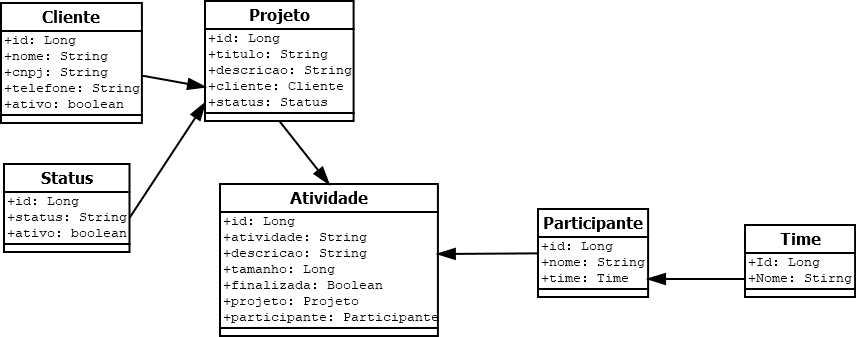

# Projeto de Gestão de Projetos

Este é um projeto BACKEND para fornecer as API's para cadastro, consulta e manutenção de um software de controle de gestão de projetos.
Foi desenvolvido em Java 17, utilizando o gerenciador de dependências Maven, persistência em Postgresql e a estrutura de testes JUnit.

## Funcionalidades

- Existe a possibilidade de inclusão, alteração, exclusão, consulta por ID e listagem geral dos cadastros de Time, Participante, Status, Cliente, Projeto e Atividades.
- Além de com relação ao projeto, listar todos os projetos em aberto e listar também as atividades de cada projeto.
- Para acessar todas as funcionalidades disponíveis e seus parâmetros após subir o projeto basta acessar o endereço http://localhost:8080/swagger-ui/index.html#

## Diagrama de Classes

## Requisitos

- Java 17
- Maven
- Postgresql


# Autor

Marco Aurélio da Silva

https://www.linkedin.com/in/maraureliosilva

# Script para criação do banco de dados e tabelas
```
CREATE DATABASE "apiGestao"
WITH
OWNER = postgres
ENCODING = 'UTF8'
LC_COLLATE = 'Portuguese_Brazil.1252'
LC_CTYPE = 'Portuguese_Brazil.1252'
LOCALE_PROVIDER = 'libc'
TABLESPACE = pg_default
CONNECTION LIMIT = -1
IS_TEMPLATE = False;
```
```
CREATE SCHEMA IF NOT EXISTS main
AUTHORIZATION postgres;
```
```
CREATE TABLE IF NOT EXISTS main."time"
(
id numeric(20,0) NOT NULL,
nome character varying(100) COLLATE pg_catalog."default" NOT NULL,
CONSTRAINT "PK_TIME" PRIMARY KEY (id)
)

TABLESPACE pg_default;

ALTER TABLE IF EXISTS main."time"
OWNER to postgres;

COMMENT ON TABLE main."time"
IS 'Cadastro de Times';
```
```
CREATE TABLE IF NOT EXISTS main.status
(
id numeric(20,0) NOT NULL,
status character varying(40) COLLATE pg_catalog."default" NOT NULL,
ativo boolean NOT NULL DEFAULT true,
CONSTRAINT "PK_STATUS" PRIMARY KEY (id)
)

TABLESPACE pg_default;

ALTER TABLE IF EXISTS main.status
OWNER to postgres;

COMMENT ON TABLE main.status
IS 'Cadastro de Status dos Projetos';
```
```
CREATE TABLE IF NOT EXISTS main.participante
(
id numeric(20,0) NOT NULL,
nome character varying(100) COLLATE pg_catalog."default" NOT NULL,
"idTime" numeric(20,0),
CONSTRAINT "PK_PARTICIPANTE" PRIMARY KEY (id)
)

TABLESPACE pg_default;

ALTER TABLE IF EXISTS main.participante
OWNER to postgres;

COMMENT ON TABLE main.participante
IS 'Cadastro de Participantes';
```
```
CREATE TABLE IF NOT EXISTS main.cliente
(
id numeric(20,0) NOT NULL,
nome character varying(100) COLLATE pg_catalog."default" NOT NULL,
cnpj numeric(14,0) NOT NULL,
telefone character varying(14) COLLATE pg_catalog."default",
ativo boolean NOT NULL DEFAULT true,
CONSTRAINT "PK_CLIENTE" PRIMARY KEY (id)
)

TABLESPACE pg_default;

ALTER TABLE IF EXISTS main.cliente
OWNER to postgres;

COMMENT ON TABLE main.cliente
IS 'Tabela de Clientes';
```
```
CREATE TABLE IF NOT EXISTS main.projeto
(
id numeric(20,0) NOT NULL,
titulo character varying(100) COLLATE pg_catalog."default" NOT NULL,
descricao text COLLATE pg_catalog."default",
"idCliente" numeric(20,0) NOT NULL,
"idStatus" numeric(20,0) NOT NULL,
CONSTRAINT "PK_PROJETO" PRIMARY KEY (id),
CONSTRAINT "FK_PROJETO_CLIENTE" FOREIGN KEY ("idCliente")
REFERENCES main.cliente (id) MATCH SIMPLE
ON UPDATE NO ACTION
ON DELETE NO ACTION,
CONSTRAINT "FK_PROJETO_STATUS" FOREIGN KEY ("idStatus")
REFERENCES main.status (id) MATCH SIMPLE
ON UPDATE NO ACTION
ON DELETE NO ACTION
NOT VALID
)

TABLESPACE pg_default;

ALTER TABLE IF EXISTS main.projeto
OWNER to postgres;

COMMENT ON TABLE main.projeto
IS 'Cadastro de Projetos';
```
```
CREATE TABLE IF NOT EXISTS main.atividade
(
id numeric(20,0) NOT NULL,
atividade character varying(100) COLLATE pg_catalog."default" NOT NULL,
descricao text COLLATE pg_catalog."default",
"idProjeto" numeric(20,0),
finalizada boolean NOT NULL DEFAULT false,
tamanho numeric,
"idParticipante" numeric(20,0),
CONSTRAINT "PK_ATIVIDADE" PRIMARY KEY (id),
CONSTRAINT "FK_ATIVIDADE_PARTICIPANTE" FOREIGN KEY ("idParticipante")
REFERENCES main.participante (id) MATCH SIMPLE
ON UPDATE NO ACTION
ON DELETE NO ACTION
NOT VALID,
CONSTRAINT "FK_ATIVIDADE_PROJETO" FOREIGN KEY ("idProjeto")
REFERENCES main.projeto (id) MATCH SIMPLE
ON UPDATE NO ACTION
ON DELETE NO ACTION
)

TABLESPACE pg_default;

ALTER TABLE IF EXISTS main.atividade
OWNER to postgres;

COMMENT ON TABLE main.atividade
IS 'Cadastro de Atividades';
```
